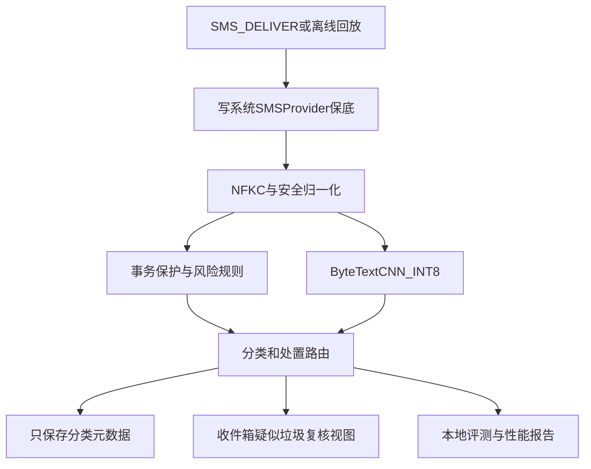

# Android 终端侧离线短信分类识别系统

## 完整实施、交付与最终审核方案

> 文档用途：本文件是项目唯一主实施规格，可直接交给能力较弱的 AI 或开发人员按阶段执行。  
> 交付形态：默认短信 Demo App + 可复用离线分类 SDK（AAR）+ 模型训练、蒸馏、剪枝、量化源码 + 全链路文档与验收报告。  
> 核心约束：短信不上云、端侧额外内存 ≤100 MB、单条全链路时延 ≤500 ms、事务召回率 ≥98%、支持中文/英文/印地语/印尼语。  
> 安全原则：任何版本均不得自动永久删除短信。疑似垃圾进入可恢复的隔离视图；分类失败、超时或低置信时优先保证消息可见。

---

## 0. 给执行 AI 的强制规则

执行本项目时必须遵守以下规则，不得自行改变：

1. 每次只完成一个阶段，阶段验收通过后再进入下一阶段。
2. 不得将任何短信、数据集、模型、日志或构建产物上传到公网。
3. 依赖只能来自官方仓库或经批准的开源上游；第三方来源必须记录许可证。
4. Android App 和 SDK 不得申请 `INTERNET` 权限，不得接入广告、统计、崩溃上报、远程配置 SDK。
5. 不得使用云端分类接口，不得在运行时下载模型或规则。
6. 不得把所有低置信短信直接标成“事务”来刷高事务召回率。
7. 不得把“分类类别”和“是否拦截”混为同一个字段。
8. 不得自动删除短信。所有疑似垃圾必须可查看、可恢复。
9. 不得随机拆分高度重复的短信模板；必须按来源、发送方和模板簇分组切分。
10. 不得声称指标已经达标，除非有真实脚本输出、数据清单和真机报告。
11. 每个脚本必须支持 `--help`，失败时返回非零退出码，并固定随机种子。
12. 每个阶段都必须更新 `docs/progress.md`，记录已完成项、命令、结果、遗留问题。
13. 不要擅自增加 GAN、LLM 端侧推理、四个语言模型常驻、联网更新等非必要功能。
14. 若本文件与其他旧方案冲突，以本文件为准。

---

## 1. 课题定义与成功标准

### 1.1 课题名称

Android 终端侧离线短信分类识别系统。

### 1.2 分类标签

系统只输出以下四个语义类别：

| 中文 | 枚举 | 可执行定义 |
|---|---|---|
| 事务 | `TRANSACTION` | 用户预期或必须触达的认证、账户、支付结果、物流、出行、订单和系统操作通知 |
| 广告 | `AD` | 来源和意图相对明确的合法商业促销、品牌推广、优惠活动 |
| 骚扰 | `HARASS` | 非欺骗但明显扰民的催收、重复推销、成人、赌博、灰产招揽等内容 |
| 诈骗 | `FRAUD` | 通过冒充、恐吓、钓鱼链接、虚假奖励、诱导转账或索取凭证造成损失的内容 |

`HARASS` 不以“用户收到过多次”作为唯一标注条件，因为训练模型的基本输入只有单条正文。发送频率只能作为后处理的可选特征。

### 1.3 分类和处置必须分离

分类结果之外，系统必须输出独立处置动作：

| 动作 | 枚举 | 行为 |
|---|---|---|
| 正常收件箱 | `INBOX` | 正常展示和通知 |
| 疑似垃圾 | `SUSPECT` | 进入可恢复的疑似垃圾视图，可降低通知等级 |
| 人工复核 | `REVIEW` | 模型低置信、规则冲突或未知分布，保持消息可见 |

重要规则：

- OTP 保护规则可以强制 `action=INBOX`，但不能无条件把语义类别改成 `TRANSACTION`。
- “验证码 + 安全账户/转账/高危链接”等冲突消息可以分类为 `FRAUD`，同时保持 `action=INBOX` 并显示高危警告。
- 低置信度输出 `REVIEW`，评测时仍保留原始四分类概率，不得计为事务正确。

### 1.4 硬性验收指标

| 指标 | 硬性要求 | 测量口径 |
|---|---:|---|
| 端侧额外内存 | ≤100 MB | 模型加载前后进程 PSS 增量及峰值 |
| 单条全链路时延 | ≤500 ms | 接收/回放输入至分类结果生成，报告冷、热路径 |
| 事务召回率 | ≥98% | 冻结测试集上的点估计，同时报告 95% Wilson 区间 |
| 四分类能力 | 必须可区分 | 每类 Precision/Recall/F1 和混淆矩阵 |
| 多语种 | 4 种 | 中、英、印地、印尼独立报告 |
| 对抗能力 | 必须提供 | 干净集、已知扰动、未见扰动分别报告 |
| 离线性 | 100% 本地 | 无 `INTERNET` 权限、无网络依赖、飞行模式可运行 |
| 可恢复性 | 100% | 不自动永久删除，疑似垃圾可恢复 |

### 1.5 不可虚假承诺

“绝对不会误杀”不是统计模型可以证明的技术指标。工程上采用以下等价安全承诺：

1. 不自动永久删除任何短信。
2. OTP、银行、物流等保护消息始终保持可见。
3. 分类失败或超时默认进入安全收件路径。
4. 用冻结测试集证明事务召回率达到要求。

---

## 2. 最终交付物

必须交付以下全部内容：

1. 可安装 Debug/Release APK。
2. 可复用 `classifier-sdk.aar`。
3. INT8 LiteRT/TFLite 模型。
4. 随包离线规则资源。
5. 数据整理、清洗、切分、增强源码。
6. 教师模型训练源码。
7. 学生模型蒸馏源码。
8. 结构化剪枝源码。
9. PTQ 与 QAT 量化源码。
10. Keras 与 LiteRT 一致性验证源码。
11. Android 单元测试和仪器化测试。
12. 四语种分类评测报告。
13. 对抗鲁棒性评测报告。
14. 4GB/6GB 真机性能报告。
15. 数据来源与许可证清单。
16. 开源软件声明和 SBOM。
17. 架构、接口、隐私、部署、测试、演示和最终审核文档。
18. 一条命令可执行的主要流水线。

---

## 3. 固定技术选型

执行 AI 不得自行替换以下主方案：

| 模块 | 固定选型 |
|---|---|
| Android 语言 | Kotlin |
| UI | Jetpack Compose 或项目创建时选定的单一官方 UI 技术，不混用两套架构 |
| 最低系统 | `minSdk` 以目标真机为准，建议 API 26；创建项目时记录最终值 |
| 默认短信角色 | Android 10+ 使用 `RoleManager.ROLE_SMS` |
| 异步 | Kotlin Coroutines；Receiver 使用 `goAsync()` |
| 端侧推理 | LiteRT/TensorFlow Lite Interpreter，CPU INT8 为验收基线 |
| 主学生模型 | UTF-8 Byte-level TextCNN |
| 教师模型 | 训练环境本地可用的多语 BERT；默认 `bert-base-multilingual-cased` |
| 模型输入 | 固定长度 512 UTF-8 bytes |
| 量化 | 全整型 INT8 PTQ，精度不达标时 QAT |
| 剪枝 | 物理缩小网络通道的结构化剪枝 |
| 规则 | APK/AAR 随包 JSON，禁止联网热更新 |
| 自建存储 | Room，仅保存消息 URI/ID 与分类元数据，不复制正文 |
| 构建 | Gradle Wrapper + Python 虚拟环境 + 锁定依赖 |

### 3.1 为什么不以 TinyBERT 作为端侧主模型

现有方案中的“多语 TinyBERT-4L”没有固定词表、层数、隐藏维度和可转换算子。多语 BERT 的大词表会显著占用模型体积，LayerNorm、Softmax 和动态形状还可能导致 INT8 回退或引入 Select TF Ops。

Byte-level TextCNN 的优势：

- 只有 257 个输入 ID，不需要四语种词表。
- 可处理中文、英文、天城文、印尼语和混合脚本。
- 对插符号、拼写变形和未知词更稳定。
- 卷积、池化、全连接易于转成 LiteRT INT8。
- 模型体积和内存远低于 100 MB。
- 可通过多语教师模型蒸馏补充语义能力。

TinyBERT/MobileBERT 只作为对比实验，不作为首个可交付版本。

---

## 4. 总体架构



### 4.1 数据流

1. 默认短信 Receiver 收到 PDU。
2. 合并 multipart 消息并取得 sender、subscriptionId、timestamp、body。
3. 先把原短信写入系统 `Telephony.Sms` Provider，防止进程死亡导致丢信。
4. 正文仅在内存中进入归一化、规则和模型。
5. 分类结果关联系统消息 URI，写入自建元数据库。
6. UI 从系统 Provider 读取正文，从自建数据库读取类别和解释。
7. App 不上传、不导出、不记录完整正文。

### 4.2 Android 持久化边界

旧方案中的“短信正文完全不落盘”无法与默认短信应用职责同时成立。正确边界如下：

- 允许：Android 系统 SMS Provider 保存短信。
- 禁止：自建 Room 数据库重复保存短信正文。
- 禁止：日志打印正文。
- 禁止：崩溃报告携带正文。
- 禁止：自动备份自建敏感分类数据。
- 允许：用户通过系统 SAF 主动导出脱敏评测报告。

---

## 5. 目标工程目录

```text
/home/oppo/
├── README.md
├── Makefile
├── LICENSE
├── NOTICE
├── Android终端侧离线短信分类识别系统-完整实施与最终审核方案.md
├── android/
│   ├── settings.gradle.kts
│   ├── build.gradle.kts
│   ├── gradle.properties
│   ├── gradlew
│   ├── gradlew.bat
│   ├── gradle/wrapper/
│   ├── app/
│   │   ├── build.gradle.kts
│   │   └── src/
│   │       ├── main/
│   │       │   ├── AndroidManifest.xml
│   │       │   ├── java/.../
│   │       │   │   ├── MainActivity.kt
│   │       │   │   ├── role/SmsRoleManager.kt
│   │       │   │   ├── receiver/SmsDeliverReceiver.kt
│   │       │   │   ├── receiver/MmsDeliverReceiver.kt
│   │       │   │   ├── service/RespondViaMessageService.kt
│   │       │   │   ├── send/ComposeSmsActivity.kt
│   │       │   │   ├── data/SmsProviderRepository.kt
│   │       │   │   ├── data/ClassificationDatabase.kt
│   │       │   │   ├── ui/inbox/
│   │       │   │   ├── ui/suspect/
│   │       │   │   ├── ui/review/
│   │       │   │   ├── ui/evaluation/
│   │       │   │   └── ui/performance/
│   │       │   ├── res/
│   │       │   └── assets/eval/
│   │       ├── test/
│   │       └── androidTest/
│   ├── classifier-sdk/
│   │   ├── build.gradle.kts
│   │   └── src/
│   │       ├── main/
│   │       │   ├── AndroidManifest.xml
│   │       │   ├── java/.../
│   │       │   │   ├── SmsClassifier.kt
│   │       │   │   ├── ClassificationResult.kt
│   │       │   │   ├── TextNormalizer.kt
│   │       │   │   ├── ByteEncoder.kt
│   │       │   │   ├── RuleEngine.kt
│   │       │   │   ├── LiteRtClassifier.kt
│   │       │   │   ├── DecisionRouter.kt
│   │       │   │   └── ModelMetadata.kt
│   │       │   └── assets/
│   │       │       ├── model/sms_bytecnn_int8.tflite
│   │       │       ├── model/model_metadata.json
│   │       │       ├── rules/otp_rules.json
│   │       │       ├── rules/transaction_rules.json
│   │       │       ├── rules/fraud_rules.json
│   │       │       └── normalize/confusables.json
│   │       └── test/
│   └── benchmark/
│       └── src/androidTest/
├── training/
│   ├── pyproject.toml
│   ├── requirements.lock
│   ├── configs/
│   │   ├── labels.yaml
│   │   ├── teacher.yaml
│   │   ├── student.yaml
│   │   ├── pruning.yaml
│   │   └── quantization.yaml
│   ├── data/
│   │   ├── raw/
│   │   ├── interim/
│   │   ├── processed/
│   │   ├── manifests/
│   │   └── README.md
│   ├── src/
│   │   ├── schema.py
│   │   ├── normalize.py
│   │   ├── deduplicate.py
│   │   ├── split_groups.py
│   │   ├── augment.py
│   │   ├── byte_encoder.py
│   │   ├── model_student.py
│   │   └── metrics.py
│   ├── scripts/
│   │   ├── audit_sources.py
│   │   ├── build_dataset.py
│   │   ├── validate_labels.py
│   │   ├── train_baseline.py
│   │   ├── train_teacher.py
│   │   ├── distill_student.py
│   │   ├── prune_channels.py
│   │   ├── quantize_int8.py
│   │   ├── verify_tflite.py
│   │   ├── evaluate.py
│   │   └── export_android_assets.py
│   └── tests/
├── tools/
│   ├── audit_release.py
│   ├── check_no_network_permission.py
│   ├── check_no_sensitive_logs.py
│   ├── check_model_ops.py
│   └── generate_sbom.sh
├── docs/
│   ├── progress.md
│   ├── architecture.md
│   ├── labeling-guide.md
│   ├── data-governance.md
│   ├── model-card.md
│   ├── sdk-api.md
│   ├── android-integration.md
│   ├── privacy-threat-model.md
│   ├── test-plan.md
│   ├── performance-report.md
│   ├── multilingual-report.md
│   ├── adversarial-report.md
│   ├── open-source-notices.md
│   ├── release-audit-report.md
│   └── demo-script.md
└── reports/
    ├── metrics/
    ├── benchmarks/
    ├── audit/
    └── release/
```

---

## 6. SDK 接口规格

### 6.1 输入

```kotlin
data class SmsInput(
    val sender: String?,
    val body: String,
    val timestampMillis: Long,
    val subscriptionId: Int? = null,
    val localeHint: String? = null
)
```

### 6.2 输出

```kotlin
enum class SmsCategory {
    TRANSACTION, AD, HARASS, FRAUD
}

enum class SmsAction {
    INBOX, SUSPECT, REVIEW
}

data class ClassificationResult(
    val category: SmsCategory,
    val action: SmsAction,
    val probabilities: FloatArray,
    val confidence: Float,
    val rawModelCategory: SmsCategory,
    val ruleIds: List<String>,
    val reasonCode: String,
    val languageHint: String?,
    val elapsedMs: Double,
    val modelVersion: String,
    val rulesVersion: String,
    val normalizationVersion: String
)
```

### 6.3 主接口

```kotlin
interface SmsClassifier : AutoCloseable {
    suspend fun classify(input: SmsInput): ClassificationResult
    fun warmUp()
    override fun close()
}
```

### 6.4 线程与生命周期

- Interpreter 在进程内保持单例。
- 推理不能在主线程运行。
- 同一 Interpreter 默认串行访问；需要并发时使用固定小池，不得每条消息创建实例。
- 模型使用 `MappedByteBuffer` 加载。
- `close()` 必须释放 Interpreter。
- 内存紧张时可卸载模型并退化为规则 + `REVIEW`，不得丢信。

---

## 7. 文本归一化与字节编码

### 7.1 固定归一化顺序

1. 空值保护和长度上限保护。
2. Unicode NFKC。
3. 删除明确的零宽控制字符。
4. 统一全角/半角和常见空白。
5. 连续无意义空白压缩。
6. 受控 confusables 映射。
7. 受控中文变形词映射只用于生成额外特征或规则匹配，不覆盖原文。
8. 保留天城文组合附标、emoji 和有语义标点。

禁止：

- 禁止全局删除 combining marks。
- 禁止把全部非 ASCII 字符删掉。
- 禁止对印地语做 ASCII 化。
- 禁止训练和 Android 使用不同归一化实现而不做一致性测试。

### 7.2 Byte 编码

固定算法：

1. 对归一化文本执行 UTF-8 编码。
2. 每个无符号 byte `0..255` 映射为 token ID `1..256`。
3. `0` 仅用于 PAD。
4. 最大长度 512 bytes。
5. 超长短信保留头部 384 bytes 和尾部 128 bytes。
6. 输出固定 `int32[1,512]`。

必须编写 Python/Kotlin 一致性测试，同一输入的 512 个 token 必须完全相同。

---

## 8. 规则引擎

### 8.1 规则文件格式

```json
{
  "version": "1.0.0",
  "rules": [
    {
      "id": "OTP_CN_001",
      "language": "zh",
      "type": "OTP_PROTECT",
      "priority": 100,
      "pattern": "(?:验证码|动态密码|校验码)\\s*[:：是为]?\\s*([0-9]{4,8})",
      "categoryHint": "TRANSACTION",
      "action": "INBOX",
      "reasonCode": "OTP_WITH_NEARBY_CODE",
      "enabled": true
    }
  ]
}
```

### 8.2 规则类型

1. `OTP_PROTECT`：OTP 词和邻近 4–8 位数字。
2. `PICKUP_PROTECT`：取件词和邻近数字/字母码。
3. `TRANSACTION_HINT`：银行入账、扣款、航班、订单等高精度结构。
4. `FRAUD_RISK`：安全账户、冒充公检法、索取验证码、异常高危 URL 等组合。
5. `AD_HINT`：退订、促销、优惠券等组合。
6. `HARASS_HINT`：催收、赌博、成人、灰产招揽等组合。

### 8.3 规则设计约束

- 单独出现“转账”“余额”“客户”不能强制事务。
- 单独出现 4–8 位数字不能判定 OTP。
- 联系人只能影响处置动作，不能替代正文分类。
- OTP 保护不得屏蔽诈骗风险提示。
- Java/Kotlin 正则必须预编译。
- 对每条规则提供正例、反例、冲突例测试。
- 不接受可能导致灾难性回溯的正则。

### 8.4 路由伪代码

```kotlin
suspend fun route(input: SmsInput): ClassificationResult {
    val normalized = normalizer.normalize(input.body)
    val signals = ruleEngine.collectSignals(normalized, input.sender)
    val prediction = model.predict(byteEncoder.encode(normalized))

    val rawCategory = prediction.argmaxCategory()
    val calibrated = calibrator.apply(prediction, input.localeHint)
    val category = calibrated.argmaxCategory()

    val conflict = signals.hasOtpProtect && signals.hasHighFraudRisk
    val lowConfidence = calibrated.maxProbability < thresholdFor(category)

    val action = when {
        conflict -> SmsAction.REVIEW
        signals.hasOtpProtect -> SmsAction.INBOX
        lowConfidence -> SmsAction.REVIEW
        category == SmsCategory.TRANSACTION -> SmsAction.INBOX
        category == SmsCategory.FRAUD && calibrated.fraud >= fraudActionThreshold ->
            SmsAction.SUSPECT
        category == SmsCategory.AD || category == SmsCategory.HARASS ->
            SmsAction.SUSPECT
        else -> SmsAction.REVIEW
    }

    return buildResult(category, action, rawCategory, calibrated, signals)
}
```

---

## 9. 数据方案

### 9.1 数据记录格式

每条样本保存为 JSONL：

```json
{
  "id": "sha256-generated-id",
  "text": "短信正文",
  "label": "TRANSACTION",
  "language": "zh",
  "source": "source-name",
  "source_license": "CC-BY-4.0",
  "sender_group": "hashed-or-template-sender",
  "template_group": "cluster-id",
  "is_synthetic": false,
  "is_adversarial": false,
  "parent_id": null,
  "annotator_ids": ["A01", "A02"],
  "split": "train"
}
```

原始私有数据不得提交 Git。仓库只提交数据清单、哈希和获批的公开样例。

### 9.2 可参考数据

#### 官方或学术来源

1. UCI SMS Spam Collection  
   官方地址：https://archive.ics.uci.edu/dataset/228/sms+spam+collection  
   用途：英文 Ham/Spam 基线。  
   限制：二分类，不能直接当四分类。

2. Unicode confusables 数据  
   官方地址：https://www.unicode.org/Public/security/latest/  
   用途：生成受控同形字符映射。  
   使用前记录 Unicode 许可与版本。

#### 第三方开源来源

1. SpamShield Datasets【第三方】  
   地址：https://huggingface.co/datasets/M-Arjun/SpamShield-Datasets  
   标称许可证：CC BY 4.0。  
   限制：需审计聚合来源；不包含标准印地语，Hinglish 不能替代 Hindi；可能含合成数据。

2. 其他 Kaggle/Hugging Face/Mendeley 数据【第三方】  
   只有在许可证、来源和可再分发范围明确后才能使用。  
   页面可下载不等于允许再分发。

### 9.3 数据规模建议

目标不是单纯追求数量，而是覆盖独立模板和真实边界。

| 数据层级 | 每语种建议 | 用途 |
|---|---:|---|
| 训练集 | 每类 ≥1000，事务尽量更多 | 模型训练 |
| 验证集 | 每类 ≥200 | 阈值和校准 |
| 冻结测试集 | 每类 ≥500 | 最终分类验收 |
| 事务专项集 | 每语种 ≥500 | 事务召回 |
| 对抗测试集 | 每语种 ≥300 | 鲁棒性 |

数据不足时允许先完成可运行 Demo，但报告必须明确“工程闭环完成、业务指标待扩充数据验证”。

### 9.4 标注决策树

按顺序判断：

1. 是否是用户预期且必须触达的操作结果、验证码或业务通知？是则 `TRANSACTION`。
2. 是否存在冒充、欺骗、索取凭证、诱导支付、钓鱼链接或虚假威胁？是则 `FRAUD`。
3. 是否是来源相对明确的正常商业促销？是则 `AD`。
4. 是否是非欺骗但明显扰民、灰产、催收、赌博、成人或反复推销？是则 `HARASS`。
5. 无法确定时标记为 `NEEDS_REVIEW`，不得强行进入训练集。

### 9.5 标注质量

- 测试集必须双人独立标注。
- 争议样本由第三人仲裁。
- 报告 Cohen's Kappa 或 Krippendorff's Alpha。
- 一致性低于 0.8 时先修订标签规范。
- 保存标注版本，但不在公开报告暴露敏感正文。

### 9.6 去重和切分

正确顺序：

1. 精确去重。
2. 文本归一后去重。
3. MinHash/SimHash 近重复聚类。
4. 按发送方、模板簇、活动批次、翻译族组成 group。
5. 按 group 切分 train/validation/test。
6. 切分完成后只增强 train。

禁止：

- 同一模板轻微改数字后跨训练集和测试集。
- 原文在训练集、翻译在测试集。
- 干净样本在训练集、其简单插符版本在最终未见扰动测试集。

---

## 10. 对抗增强

### 10.1 训练增强

仅对训练集执行：

- 零宽字符插入。
- 随机标点和空格插入。
- 全角/半角替换。
- 拉丁、希腊、西里尔同形字符替换。
- 英文大小写、常见缩写和轻微拼写错误。
- 中文受控谐音/形近字替换，如“微信→薇信/v信”。
- Hindi Devanagari 与拉丁化 Hindi 的受控变体。
- Indonesian 常见缩写和非正式拼写。
- 数字、金额、URL、电话号码占位替换。

### 10.2 三套鲁棒性评测

1. `clean_test`：无增强的冻结真实样本。
2. `known_attack_test`：与训练增强同类型但不同随机实例。
3. `unseen_attack_test`：训练未使用的组合扰动和人工构造变体。

不得只报告增强后的总体准确率。

---

## 11. 模型规格

### 11.1 学生模型固定结构

输入：`int32[batch, 512]`。

建议初始结构：

```text
Input token ids: 512
Embedding: vocab=257, dim=48
Parallel Conv1D:
  branch A: filters=64, kernel=3, ReLU
  branch B: filters=64, kernel=5, ReLU
  branch C: filters=64, kernel=7, ReLU
GlobalMaxPool1D for each branch
Concatenate: 192
Dense: 96, ReLU
Dropout: 0.2, training only
Dense: 4 logits
```

约束：

- 首版使用标准 Conv1D，优先保证 INT8 可转换。
- 不使用自定义算子。
- 不使用 Select TF Ops。
- 不在端侧执行 Softmax 以外的复杂解释算法。
- 模型输出顺序固定为 `[TRANSACTION, AD, HARASS, FRAUD]`。

### 11.2 基线模型

必须训练并报告：

1. 字符/字节 n-gram Logistic Regression。
2. 未蒸馏的 Byte TextCNN。
3. 蒸馏后的 Byte TextCNN。
4. 剪枝后的 Byte TextCNN。
5. INT8 PTQ/QAT 模型。

这样可以证明蒸馏、剪枝和量化各自的真实收益。

### 11.3 教师模型

默认使用本地缓存的多语 BERT：

```text
google-bert/bert-base-multilingual-cased
```

注意：

- 模型下载来源属于第三方模型托管平台时必须标记【第三方】并记录哈希。
- 优先使用公司批准的内部镜像或已审计缓存。
- 教师模型只在训练机使用，不进入 APK。
- 不把私有短信上传到模型托管平台。

### 11.4 训练损失

学生蒸馏损失：

```text
total_loss =
    alpha * weighted_cross_entropy(student_logits, true_label)
  + beta  * KL(softmax(teacher_logits / T), softmax(student_logits / T)) * T^2
```

初始建议：

- `T=4.0`
- `alpha=0.6`
- `beta=0.4`

这些参数只能在验证集调整，最终值写入配置和 Model Card。

### 11.5 类别不平衡

优先顺序：

1. 语种和类别均衡采样。
2. 类别权重交叉熵。
3. 难例采样。
4. 必要时 Focal Loss 对比。

不把 SMOTE/ADASYN 直接用于离散文本 token；首版不使用 GAN。

---

## 12. 结构化剪枝

### 12.1 必须实现的方式

不能只把权重变成零。必须真实减少通道：

1. 训练稠密学生模型。
2. 计算每个 Conv1D 输出通道的重要度，例如权重 L1 范数。
3. 每个分支先剪除 25% 低重要度通道。
4. 重建 filters 更少的新模型。
5. 拷贝保留通道及其后续 Dense 对应权重。
6. 微调恢复精度。
7. 导出并比较参数量、文件体积、FLOPs、真机时延。

如果 25% 剪枝使事务召回下降超过 0.5 个百分点或 Macro-F1 下降超过 1 个百分点，则尝试 10%/15%，不得强行保留劣化模型。

### 12.2 剪枝验收

报告至少包含：

- 稠密模型参数量。
- 剪枝后参数量。
- FP32 文件体积。
- 验证集和测试集指标变化。
- Android CPU 推理时延变化。
- 峰值 PSS 变化。

---

## 13. INT8 量化

### 13.1 PTQ

代表集必须覆盖：

- 四种语言。
- 四个类别。
- 短、中、长短信。
- 干净和对抗样本。
- 混合脚本和 URL/数字密集文本。

转换要求：

```python
converter.optimizations = [tf.lite.Optimize.DEFAULT]
converter.representative_dataset = representative_dataset
converter.target_spec.supported_ops = [
    tf.lite.OpsSet.TFLITE_BUILTINS_INT8
]
```

Embedding 的索引输入保持 `int32` 属于正常情况；权重和支持的计算激活应为 INT8。输出可使用 INT8 并在 SDK 中按量化参数反量化。

### 13.2 QAT 触发条件

若 PTQ 相对剪枝后 FP32 模型满足任一条件，则执行 QAT：

- 事务召回下降 >0.3 个百分点。
- 任一语种 Macro-F1 下降 >1 个百分点。
- 诈骗召回下降 >1 个百分点。
- Keras 与 TFLite 大量预测类别不一致。

### 13.3 量化闸门

`verify_tflite.py` 必须检查：

1. 模型可以被标准 LiteRT Interpreter 加载。
2. 不包含 Select TF Ops。
3. 不包含自定义算子。
4. 输入输出 shape 与 metadata 一致。
5. 至少 1000 条样本比较 Keras/TFLite 预测。
6. 输出类别一致率达到预设阈值，建议 ≥99%。
7. INT8 指标满足精度退化预算。

---

## 14. 模型元数据

`model_metadata.json` 示例：

```json
{
  "modelVersion": "1.0.0",
  "architecture": "byte_textcnn",
  "inputLength": 512,
  "padId": 0,
  "byteOffset": 1,
  "labels": ["TRANSACTION", "AD", "HARASS", "FRAUD"],
  "normalizationVersion": "1.0.0",
  "rulesVersion": "1.0.0",
  "quantization": "INT8",
  "modelSha256": "REPLACE_DURING_BUILD",
  "thresholds": {
    "default": {
      "TRANSACTION": 0.55,
      "AD": 0.70,
      "HARASS": 0.70,
      "FRAUD": 0.75
    }
  }
}
```

阈值只是占位初值，必须由验证集校准后冻结，不能在测试集上调参。

---

## 15. Android 默认短信应用实现

### 15.1 角色资格组件

Android Manifest 至少声明：

1. `SMS_DELIVER` Receiver，要求 `android.permission.BROADCAST_SMS`。
2. `WAP_PUSH_DELIVER` Receiver，要求 `android.permission.BROADCAST_WAP_PUSH`。
3. `SENDTO` Activity，覆盖 `sms`、`smsto`、`mms`、`mmsto`。
4. `RESPOND_VIA_MESSAGE` Service，要求 `android.permission.SEND_RESPOND_VIA_MESSAGE`。
5. 必要的 SMS/MMS 权限。
6. 不声明 `android.permission.INTERNET`。

Android 10+：

```kotlin
val roleManager = getSystemService(RoleManager::class.java)
if (roleManager.isRoleAvailable(RoleManager.ROLE_SMS) &&
    !roleManager.isRoleHeld(RoleManager.ROLE_SMS)
) {
    startActivityForResult(
        roleManager.createRequestRoleIntent(RoleManager.ROLE_SMS),
        REQUEST_SMS_ROLE
    )
}
```

必须先申请默认角色，再申请相关敏感权限。

### 15.2 收信流程

Receiver 必须处理：

- `Telephony.Sms.Intents.getMessagesFromIntent(intent)`。
- multipart PDU 按消息顺序合并。
- 3GPP/3GPP2 格式。
- 双卡 `subscriptionId`。
- 重复广播幂等。
- 空正文。
- 进程冷启动。
- 模型损坏或未初始化。
- 锁屏和通知隐私。

推荐流程：

```text
onReceive
  -> goAsync
  -> 后台线程解析PDU
  -> 生成幂等键
  -> 写系统SMSProvider
  -> 最多500ms分类
  -> 写分类元数据
  -> 根据action显示通知
  -> PendingResult.finish
```

无论任何异常，都必须在 `finally` 中调用 `finish()`。

### 15.3 超时和失败策略

- 分类软超时：500 ms。
- Receiver 总处理时间远低于 Android 10 秒限制。
- 超时：消息进入 `INBOX/REVIEW`。
- 模型加载失败：规则模式 + `REVIEW`。
- 自建数据库失败：系统消息仍保留并通知。
- 不依赖前台服务完成单条短信分类。
- WorkManager 只用于非实时补分类、报告生成等延后任务。

### 15.4 默认短信职责

为了成为可用默认短信 App，MVP 至少支持：

- 接收 SMS。
- 写入和读取系统 SMS Provider。
- 展示会话/消息。
- 创建短信并发送。
- 收件通知。
- 回复短信。
- 处理角色被拒绝或撤销。

MMS 可在首版提供明确的基础接收/跳转实现，但不得因分类模块导致 MMS 丢失。

---

## 16. Demo UI

### 16.1 页面

1. 首次启动与隐私说明。
2. 默认短信角色申请页。
3. 收件箱。
4. 四类筛选。
5. 疑似垃圾。
6. 人工复核。
7. 单条详情。
8. 离线评测。
9. 性能面板。
10. 关于与开源声明。

### 16.2 单条详情

展示：

- 最终类别。
- 处置动作。
- 置信度。
- 规则原因。
- 模型/规则版本。
- “为什么仍然显示”安全说明。

不展示内部难懂的张量或伪造的深度归因。模型路径的解释采用稳定 reason code 和受控关键词证据。

### 16.3 通知隐私

- 锁屏默认隐藏正文。
- 事务消息可正常通知。
- 疑似诈骗可以显示风险提示，但不能暴露验证码。
- 用户可以恢复疑似垃圾。

---

## 17. 离线评测功能

### 17.1 输入格式

```json
[
  {
    "id": "eval-001",
    "text": "您的验证码为123456",
    "label": "TRANSACTION",
    "language": "zh"
  }
]
```

### 17.2 输出

报告默认只包含：

- 样本 ID。
- 真实标签。
- 预测标签。
- 动作。
- 概率。
- 规则 ID。
- 耗时。
- 模型和规则版本。

除非用户主动选择“包含正文”，否则导出报告不含正文。

### 17.3 指标

- 每类 Precision、Recall、F1。
- Macro-F1、Weighted-F1。
- 混淆矩阵。
- 事务 Recall 与 Precision。
- 诈骗 Recall 与 Precision。
- `REVIEW` coverage。
- 各语种指标。
- 干净/对抗指标。
- P50/P95/P99/Max 时延。

---

## 18. 性能测试

### 18.1 测试设备

至少两台：

1. 4GB RAM 中低端 Android 真机。
2. 6GB RAM 中低端 Android 真机。

报告：

- 品牌和型号。
- Android 版本。
- SoC。
- CPU 架构。
- RAM。
- 电量与温度状态。
- App 版本和构建类型。

### 18.2 时延口径

分别测量：

1. 纯规则命中。
2. 模型热推理。
3. 模型冷加载 + 推理。
4. 归一化 + 规则 + 编码 + 推理 + 路由。
5. Receiver 输入至结果持久化。
6. Receiver 输入至通知可见。

每组：

- 预热单独记录。
- 正式测试至少 500 条。
- 报告 P50/P95/P99/Max。
- 不得只报告平均值。
- 冷启动不能被热启动成绩替代。

### 18.3 内存口径

记录：

1. App 启动后的基线 PSS。
2. 加载规则后的 PSS。
3. 加载模型后的 PSS。
4. 连续处理 1000 条后的峰值和稳定 PSS。
5. 模型卸载后的 PSS。

验收使用增量 PSS，同时附总 PSS 供审核。

### 18.4 CPU 基线

CPU INT8 是必测基线。NNAPI/GPU/NPU 只作附加对比，因为不同低端 SoC 的 delegate 支持不一致。

---

## 19. 业务评测与统计

### 19.1 必报指标

| 指标 | 必报 |
|---|---|
| 事务 Recall | 是，硬指标 ≥98% |
| 事务 Precision | 是 |
| 诈骗 Recall/Precision/F1 | 是 |
| 广告 Recall/Precision/F1 | 是 |
| 骚扰 Recall/Precision/F1 | 是 |
| Macro-F1 | 是 |
| 混淆矩阵 | 是 |
| Review Coverage | 是 |
| 规则单独效果 | 是 |
| 模型单独效果 | 是 |
| 完整系统效果 | 是 |
| 95% Wilson 区间 | 是 |

### 19.2 防止指标作弊

最终审核必须检查：

- 是否把低置信样本计为事务正确。
- 是否在测试集上调整阈值。
- 是否存在模板泄漏。
- 是否用训练增强副本充当测试样本。
- 是否只报告总体准确率。
- 是否隐藏事务 Precision 或诈骗 Recall。
- 是否排除了冷启动。

### 19.3 阈值冻结

1. 只在验证集拟合温度和阈值。
2. 生成 `thresholds.json`。
3. 计算 SHA-256。
4. 冻结测试集前记录哈希。
5. 测试后不得修改阈值再次报告同一测试集。

---

## 20. 隐私与安全设计

### 20.1 数据资产清单

| 数据 | 存储位置 | 保留策略 |
|---|---|---|
| 原始短信正文 | 系统 SMS Provider | 由用户和系统短信策略管理 |
| 分类类别/动作 | App 私有 Room | 与消息 ID 同生命周期 |
| 发件人 | 系统 Provider；自建库不复制明文 | 不额外保存 |
| 模型/规则版本 | App 私有 Room | 用于审计 |
| 性能数据 | App 私有目录 | 仅聚合值，用户可清除 |
| 导出报告 | 用户通过 SAF 选择 | 默认不含正文 |

### 20.2 必做措施

- Manifest 无 `INTERNET`。
- 禁止 WebView 加载远程页面。
- 禁止第三方统计和崩溃 SDK。
- Release 禁止正文日志。
- `android:allowBackup="false"` 或用数据提取规则排除敏感库。
- 数据库只放内部存储。
- 通知锁屏隐藏正文和 OTP。
- 导出必须由用户主动触发。
- 删除 App 数据时清除分类元数据。
- 规则包随 APK 发布，或通过离线签名包导入；首版不实现导入。

### 20.3 威胁模型

至少分析：

- 恶意 App 读取导出报告。
- 日志泄露。
- 截图/锁屏泄露。
- 规则投毒。
- 模型替换。
- 伪造 sender。
- OTP 文本绕过诈骗识别。
- Unicode 混淆攻击。
- 超长文本资源消耗。
- 模型文件损坏导致丢信。

---

## 21. 测试矩阵

### 21.1 SDK 单元测试

- 四语种归一化。
- 天城文组合字符不损坏。
- Python/Kotlin byte token 一致。
- 正则正例、反例、冲突例。
- 空文本、纯数字、超长文本。
- 模型输出 shape 和概率。
- 阈值路由。
- OTP + 诈骗冲突。
- 低置信进入 `REVIEW`。
- 模型异常安全降级。

### 21.2 Android 单元/集成测试

- 默认角色可用、持有、拒绝、撤销。
- multipart PDU 合并。
- 双卡 subscriptionId。
- Receiver `finish()`。
- Provider 写入幂等。
- 自建库不保存正文。
- 收件通知。
- 隔离和恢复。
- 进程冷启动。
- 飞行模式。
- 无 `INTERNET` 权限。

### 21.3 回归测试

每次修改规则、模型、归一化或阈值后执行：

```text
unit tests
clean multilingual evaluation
transaction golden evaluation
adversarial evaluation
Keras/TFLite parity
Android SDK instrumentation
release security audit
```

---

## 22. 构建与复现命令

最终 `Makefile` 必须提供以下目标：

```bash
make setup-python
make audit-data
make prepare-data
make train-baseline
make train-teacher
make distill
make prune
make quantize
make verify-model
make evaluate
make export-android-assets
make android-test
make android-build
make benchmark
make audit-release
make package-release
```

完整流水线：

```bash
make prepare-data \
  && make train-teacher \
  && make distill \
  && make prune \
  && make quantize \
  && make verify-model \
  && make evaluate \
  && make export-android-assets \
  && make android-test \
  && make android-build \
  && make audit-release
```

若训练耗时过长，允许拆开运行，但每一步必须产出带哈希的 manifest。

---

## 23. 分阶段实施任务卡

### 阶段 0：环境和骨架

输入：

- 本方案。
- Android SDK/JDK/Python 环境。

步骤：

1. 创建目录树。
2. 初始化 Android Gradle 多模块。
3. 初始化 Python 项目。
4. 创建 Makefile。
5. 创建空白进度文档。
6. 确保不申请网络权限。

输出：

- App 空壳可编译。
- SDK 空壳可编译。
- Python 单元测试可运行。

门禁：

- `./gradlew test` 成功。
- Python tests 成功。
- Manifest 无 `INTERNET`。

### 阶段 1：规则与离线 SDK

步骤：

1. 实现 NFKC 归一化。
2. 实现 byte encoder。
3. 实现规则 JSON 加载。
4. 实现 RuleEngine。
5. 实现无模型降级分类。
6. 编写四语规则测试。

输出：

- 可在 JVM 测试中运行的 SDK。
- 规则资产 v1。

门禁：

- OTP 正例命中。
- OTP 欺诈冲突进入 `REVIEW`。
- Hindi 字符回归通过。
- 无正文日志。

### 阶段 2：数据流水线

步骤：

1. 编写标签规范。
2. 编写来源审计脚本。
3. 统一 JSONL schema。
4. 精确和近重复去重。
5. group 切分。
6. 仅训练集增强。
7. 生成数据 manifest。

输出：

- train/validation/test JSONL。
- 来源和许可证清单。
- 去重和切分报告。

门禁：

- 无 ID 重叠。
- 无 template group 跨 split。
- 测试集无训练增强父样本。

### 阶段 3：模型基线与教师

步骤：

1. 训练 n-gram 基线。
2. 训练未蒸馏 Byte TextCNN。
3. 微调多语教师。
4. 输出验证指标。

输出：

- 基线模型。
- 教师 checkpoint。
- 配置和训练日志。

门禁：

- 四语种都有非空指标。
- 训练可固定种子复现。

### 阶段 4：蒸馏、剪枝、量化

步骤：

1. 缓存教师 logits。
2. 蒸馏学生。
3. 结构化通道剪枝。
4. 微调。
5. INT8 PTQ。
6. 必要时 QAT。
7. LiteRT 一致性验证。

输出：

- `sms_bytecnn_int8.tflite`。
- Model Card。
- 压缩消融报告。

门禁：

- 无 Select TF Ops。
- 无自定义算子。
- Keras/TFLite 类别一致率达标。
- 精度退化在预算内。

### 阶段 5：Android 默认短信闭环

步骤：

1. 完成 ROLE_SMS 申请。
2. 完成四类角色资格组件。
3. 完成 SMS Provider 写入。
4. 完成 multipart 和双卡处理。
5. 接入 SDK。
6. 实现收件箱、疑似垃圾、复核和恢复。
7. 实现发送和回复基础功能。

输出：

- 可设置为默认短信应用的 APK。
- 真机收信演示。

门禁：

- 真实短信不会丢失。
- 模型故障仍可收信。
- 不自动删除。
- 飞行模式可分类。

### 阶段 6：离线评测和性能

步骤：

1. 实现 assets/SAF 测试集导入。
2. 实现本地指标计算。
3. 实现脱敏报告导出。
4. 实现 PSS 和时延记录。
5. 在 4GB/6GB 真机运行。

输出：

- 四语种报告。
- 对抗报告。
- 真机报告。

门禁：

- 内存和时延达到硬指标。
- 事务召回达到要求，或明确记录未达标与阻断发布。

### 阶段 7：收尾和最终审核

步骤：

1. 运行全部测试。
2. 生成 SBOM。
3. 检查许可证。
4. 检查网络权限和敏感日志。
5. 检查指标和数据泄漏。
6. 生成审核报告。
7. 打包 APK、AAR、模型、源码和文档。

输出：

- 完整 release 包。
- `docs/release-audit-report.md`。

门禁：

- 不存在 P0 阻断项。
- 所有硬指标有证据。

---

## 24. 开源项目参考

### 24.1 可直接参考的官方项目

1. Android Default Handlers  
   https://developer.android.com/guide/topics/permissions/default-handlers

2. Android Telephony API  
   https://developer.android.com/reference/android/provider/Telephony

3. Android `Telephony.Sms.Intents`  
   https://developer.android.com/reference/android/provider/Telephony.Sms.Intents

4. Android `RoleManager`  
   https://developer.android.com/reference/android/app/role/RoleManager

5. BroadcastReceiver `goAsync()`  
   https://developer.android.com/reference/android/content/BroadcastReceiver

6. TensorFlow Examples Android Text Classification  
   https://github.com/tensorflow/examples/tree/master/lite/examples/text_classification/android  
   许可证：Apache-2.0。

7. LiteRT Benchmark  
   https://ai.google.dev/edge/litert/models/measurement

8. TensorFlow Model Optimization Pruning  
   https://www.tensorflow.org/model_optimization/guide/pruning/comprehensive_guide

### 24.2 仅用于研究的第三方项目

1. QUIK SMS【第三方】  
   https://github.com/quik-sms/quik  
   许可证：GPLv3。  
   可参考：默认短信应用交互、会话、发送、通知。  
   风险：除非整个衍生工程按 GPLv3 发布，否则不要复制源码。

2. SpamBlocker【第三方】  
   https://github.com/aj3423/SpamBlocker  
   可参考：本地规则、过滤 UX。  
   风险：SMS Screening Protocol 不是 Android 官方通用协议，不能作为主路径。

3. NekoSMS【第三方】  
   https://github.com/apsun/NekoSMS  
   许可证：GPLv3。  
   可参考：规则设计。  
   风险：依赖 Xposed，不适合作为普通 Android Demo 实现。

任何第三方代码复用前必须由最终审核确认许可证兼容性。

---

## 25. 风险与降级策略

| 风险 | 发现方式 | 降级/修复 |
|---|---|---|
| 四语数据不足 | 数据审计 | 先交付工程闭环，报告不得宣称准确率达标 |
| 事务召回不足 | 冻结测试集 | 补标难例、优化保护规则和损失，不在测试集调阈值 |
| 诈骗被 OTP 放行 | 冲突集 | 分类与动作分离，冲突进入 REVIEW |
| INT8 精度下降 | parity 和评测 | 启用 QAT 或降低剪枝率 |
| TFLite 算子回退 | op 检查 | 简化模型，不引入 Select TF Ops |
| 冷启动超时 | 真机 benchmark | 更小模型、mmap、缩短输入、规则先行、安全降级 |
| 默认短信角色不可选 | 角色资格测试 | 补齐 Manifest 组件和发送/回复职责 |
| 短信丢失 | 进程死亡测试 | 先写系统 Provider，再分类 |
| 数据泄漏 | release audit | 删除网络/日志/遥测路径 |
| GPL 污染 | SBOM/源码审查 | 删除复制代码或按法务批准的许可证交付 |

---

## 26. 最终审核方案

### 26.1 审核目标

最终审核不是只看 APK 能否打开，而是验证：

1. 工程是否可复现。
2. 默认短信链路是否真实可用。
3. 是否完全离线。
4. 是否不会因分类失败丢失重要短信。
5. 模型是否真实完成蒸馏、剪枝和 INT8 量化。
6. 指标是否没有数据泄漏和统计取巧。
7. 性能是否来自目标真机。
8. 开源许可证是否合规。

### 26.2 问题严重度

| 级别 | 定义 | 处理 |
|---|---|---|
| P0 阻断 | 会丢信、泄露数据、无法运行、指标造假、许可证重大违规 | 禁止交付 |
| P1 严重 | 核心功能不完整或硬指标无证据 | 修复后重新审核 |
| P2 一般 | 非核心缺陷、文档或体验问题 | 可带整改计划交付 |
| P3 建议 | 优化项 | 后续迭代 |

### 26.3 审核输入

审核前必须冻结：

- Git commit ID 或源码包 SHA-256。
- APK/AAR SHA-256。
- 模型 SHA-256。
- 规则包 SHA-256。
- 数据 manifest SHA-256。
- 阈值文件 SHA-256。
- 测试设备信息。
- 所有报告。

### 26.4 A 组：文档审核

检查项：

- [ ] 架构与实际代码一致。
- [ ] 标签定义可执行。
- [ ] 分类和处置分离。
- [ ] 数据来源和许可证完整。
- [ ] 模型卡包含结构、输入、输出、训练数据范围和限制。
- [ ] 隐私文档说明系统 Provider 与自建数据库边界。
- [ ] 性能报告包含冷/热路径。
- [ ] 所有“已达标”陈述都有报告证据。

阻断条件：

- 文档声称“正文不落盘”，代码却作为默认短信 App 写系统 Provider且未解释。
- 文档声称全 INT8，模型实际包含 float 回退或 Select TF Ops。
- 文档指标无法对应测试数据 manifest。

### 26.5 B 组：源码与构建审核

命令：

```bash
make setup-python
make verify-model
make android-test
make android-build
```

检查项：

- [ ] 全新环境可构建。
- [ ] Gradle Wrapper 存在。
- [ ] Python 依赖锁定。
- [ ] 所有脚本支持 `--help`。
- [ ] 固定随机种子。
- [ ] 无硬编码绝对私有路径。
- [ ] 无密钥、Token、账号。
- [ ] 无远程模型下载作为运行时依赖。

P0：

- 无法从源码生成 APK/AAR。
- 运行时必须联网下载模型。
- 源码包含敏感凭证。

### 26.6 C 组：Android 功能审核

真机步骤：

1. 安装 Release APK。
2. 申请默认短信角色。
3. 拒绝一次，确认 App 不崩溃。
4. 再次授权。
5. 接收单段短信。
6. 接收 multipart 长短信。
7. 双卡分别收信。
8. 杀进程后冷启动收信。
9. 模拟模型文件不可用。
10. 检查系统 SMS Provider 中消息存在。
11. 检查四类列表。
12. 把疑似垃圾恢复到正常视图。
13. 发送和回复一条测试短信。
14. 撤销默认角色，确认降级提示正确。

P0：

- 任意正常测试导致短信永久丢失。
- 分类失败导致不通知且不可恢复。
- App 不能成为默认短信应用。
- 自动永久删除疑似垃圾。

### 26.7 D 组：离线与隐私审核

执行：

```bash
make audit-release
adb shell dumpsys package <package-name>
```

检查项：

- [ ] 无 `INTERNET` 权限。
- [ ] 飞行模式下完整分类。
- [ ] 无广告、统计、崩溃上报 SDK。
- [ ] Release 日志无正文、OTP、完整 sender。
- [ ] Room 表无正文字段。
- [ ] 自动备份排除敏感数据。
- [ ] 导出报告默认无正文。
- [ ] 锁屏通知隐藏正文和 OTP。

P0：

- 发现短信正文网络发送路径。
- 发现未声明遥测。
- 自建数据库批量复制正文且与文档不符。

### 26.8 E 组：数据审核

执行：

```bash
make audit-data
```

检查项：

- [ ] 每个数据源有 URL、许可证、获取日期和哈希。
- [ ] 私有数据不在 Git。
- [ ] train/validation/test 无 ID 重叠。
- [ ] template group 无跨 split。
- [ ] 翻译族无跨 split。
- [ ] 对抗子样本不泄漏。
- [ ] 测试集标注经过复核。
- [ ] 报告样本量和语言分布准确。

P0：

- 测试集明显泄漏。
- 使用无权再分发的数据打包交付。
- 四语种报告实际来自翻译副本且未披露。

### 26.9 F 组：模型压缩审核

检查证据：

- [ ] 教师训练配置和 checkpoint manifest。
- [ ] 教师 logits 或可复现生成方式。
- [ ] 蒸馏损失曲线。
- [ ] 稠密学生模型。
- [ ] 结构化剪枝前后结构。
- [ ] PTQ 代表集 manifest。
- [ ] QAT 是否触发及原因。
- [ ] 最终 INT8 op/dtype 清单。
- [ ] Keras/TFLite parity 报告。

P0：

- 只有最终模型，没有蒸馏/剪枝/量化源码。
- 剪枝只是置零却宣称真实加速。
- 最终模型依赖 Select TF Ops 但文档声称标准全整型。

### 26.10 G 组：业务指标审核

执行：

```bash
make evaluate
```

必须核对：

- [ ] 测试集和阈值在测试前冻结。
- [ ] 事务 Recall ≥98%。
- [ ] 同时报告事务 Precision。
- [ ] 四类均有 Precision/Recall/F1。
- [ ] 报告 Macro-F1。
- [ ] 报告诈骗 Recall。
- [ ] 报告 REVIEW coverage。
- [ ] 报告 95% Wilson 区间。
- [ ] 按四语种拆分。
- [ ] 干净和对抗拆分。
- [ ] 混淆矩阵原始计数与指标一致。

P0：

- 把低置信自动改成事务后计算“事务召回”。
- 在测试集上调阈值。
- 隐藏失败语种或失败类别。
- 事务召回低于硬指标却标记通过。

### 26.11 H 组：性能审核

执行：

```bash
make benchmark
```

检查项：

- [ ] 使用 4GB 和 6GB 真机。
- [ ] CPU INT8 基线。
- [ ] 冷启动和热启动分开。
- [ ] 至少 500 条正式测试。
- [ ] 报告 P50/P95/P99/Max。
- [ ] 报告 PSS 基线、增量、峰值。
- [ ] 连续 1000 条无持续内存增长。
- [ ] App 内测量和 benchmark 工具结果均保留。

P0：

- 只用模拟器或旗舰机。
- 排除冷启动后声称全链路达标。
- 额外 PSS >100 MB。
- 单条全链路 >500 ms 且没有安全降级。

### 26.12 I 组：开源许可证审核

检查：

- [ ] `NOTICE`。
- [ ] `docs/open-source-notices.md`。
- [ ] SBOM。
- [ ] 每个模型、数据集、库的许可证。
- [ ] GPL 项目是否只参考而未复制。
- [ ] Apache/MIT/BSD 版权声明是否保留。

P0：

- 未经批准复制 GPLv3 代码到计划闭源或非 GPL 交付物。
- 数据许可证禁止再分发却被打包。
- 模型权重许可证不清晰且直接交付。

### 26.13 审核自动化输出

`tools/audit_release.py` 最终生成：

```text
reports/audit/
├── artifact_hashes.json
├── manifest_permissions.json
├── sensitive_log_scan.json
├── dependency_sbom.json
├── model_ops.json
├── model_quantization.json
├── dataset_leakage.json
├── metrics_check.json
├── performance_check.json
└── audit_summary.json
```

`audit_summary.json`：

```json
{
  "release": "1.0.0",
  "status": "PASS",
  "p0": 0,
  "p1": 0,
  "p2": 0,
  "checksPassed": 120,
  "checksFailed": 0,
  "artifactHashesFile": "artifact_hashes.json",
  "reviewers": ["engineering", "model", "privacy"]
}
```

只有 `p0=0`、`p1=0` 且硬指标通过时，最终状态才能为 `PASS`。

### 26.14 最终签字页

`docs/release-audit-report.md` 末尾必须包含：

| 审核角色 | 审核内容 | 结论 | 姓名/编号 | 日期 |
|---|---|---|---|---|
| Android 工程审核 | 默认角色、收发、Provider、恢复 | PASS/FAIL |  |  |
| 模型审核 | 蒸馏、剪枝、量化、一致性 | PASS/FAIL |  |  |
| 数据审核 | 来源、许可、切分、标注 | PASS/FAIL |  |  |
| 隐私安全审核 | 离线、权限、日志、存储 | PASS/FAIL |  |  |
| 性能审核 | 4GB/6GB 真机 | PASS/FAIL |  |  |
| 项目负责人 | 最终放行 | PASS/FAIL |  |  |

---

## 27. 最终交付包结构

```text
release-1.0.0/
├── apk/sms-classifier-release.apk
├── sdk/classifier-sdk.aar
├── model/sms_bytecnn_int8.tflite
├── model/model_metadata.json
├── rules/
├── source/android-source.zip
├── source/training-source.zip
├── reports/multilingual-report.md
├── reports/adversarial-report.md
├── reports/performance-report.md
├── reports/release-audit-report.md
├── licenses/NOTICE
├── licenses/sbom.json
├── checksums/SHA256SUMS
└── README.md
```

原始私有短信和无再分发许可的数据集不得进入交付包。

---

## 28. 演示脚本

答辩演示按以下顺序：

1. 手机切换飞行模式，证明无网络。
2. 展示 App 无网络权限。
3. 导入四语种离线样本并批量分类。
4. 展示事务、广告、骚扰、诈骗四类。
5. 展示正常 OTP 被保护。
6. 展示“验证码 + 安全账户转账”进入风险复核而非被静默放行。
7. 展示“薇信/v信/零宽字符”等对抗样本。
8. 展示模型体积、PSS、P95 时延。
9. 真实接收一条短信，展示收信到分类闭环。
10. 展示疑似垃圾恢复。
11. 展示四语种报告和最终审核 PASS 页面。

---

## 29. 最终结论

本项目应以“可靠通信应用 + 可审计离线分类 SDK”完成交付，而不是只做一个离线 Notebook 或关键词 Demo。最终方案的关键不是盲目追求大型 Transformer，而是：

1. 用默认短信角色完成真实收信闭环。
2. 用系统 SMS Provider 保证永不因分类失败丢信。
3. 用规则保护重要事务消息，但不掩盖 OTP 诈骗风险。
4. 用蒸馏后的 Byte TextCNN 获得多语种、低内存、易 INT8 部署能力。
5. 用结构化剪枝和量化源码证明模型压缩过程。
6. 用分类与处置分离避免“低置信全判事务”的指标取巧。
7. 用冻结数据、真机报告和最终审核脚本证明所有指标。

只有当最终审核中不存在 P0/P1 问题，且在 4GB/6GB 真机上同时满足内存、时延、事务召回、多语种、对抗和离线要求，项目才可以标记为正式完成。
